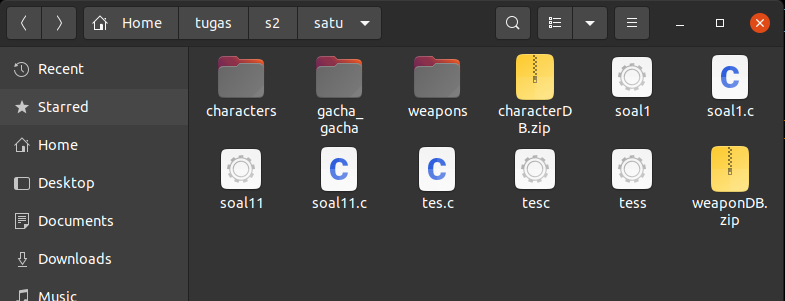
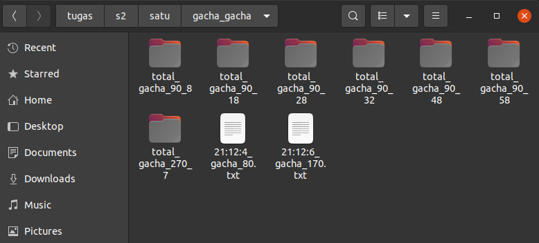
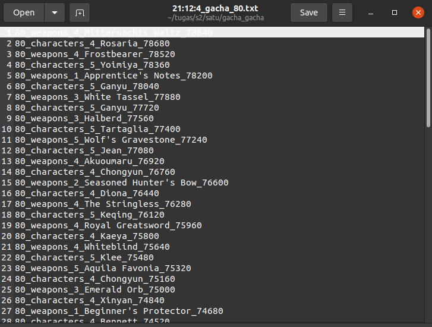
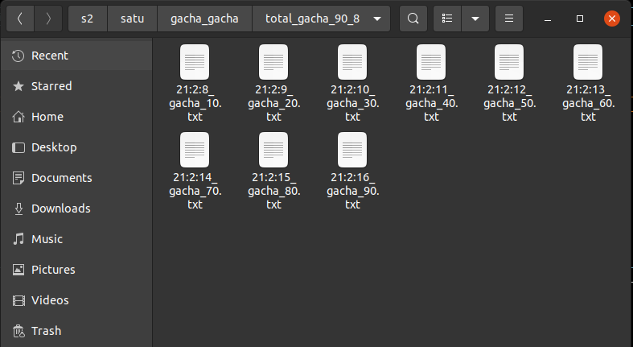
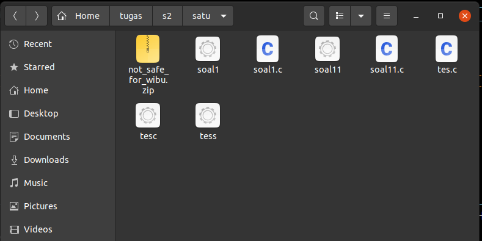
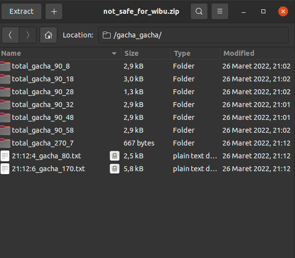
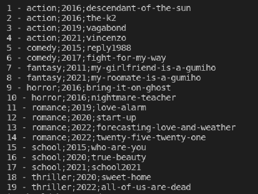
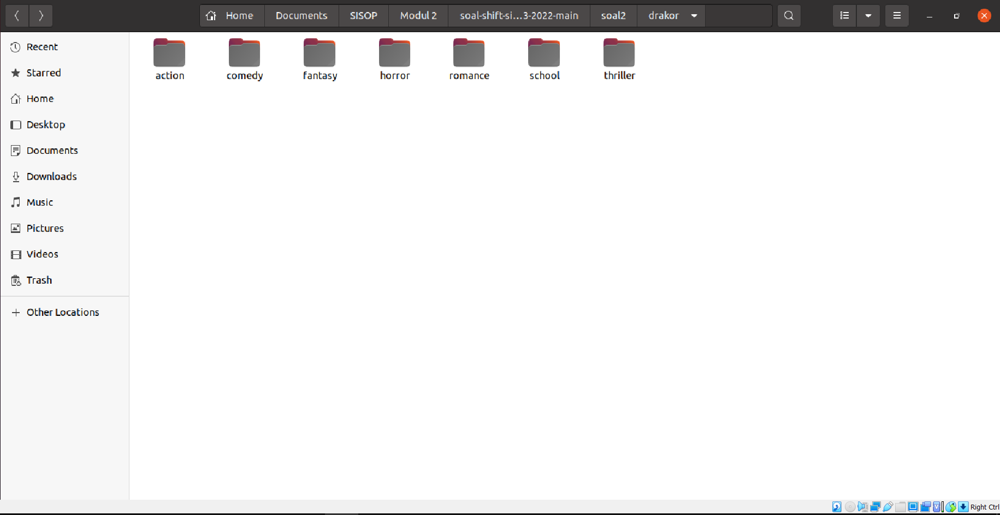
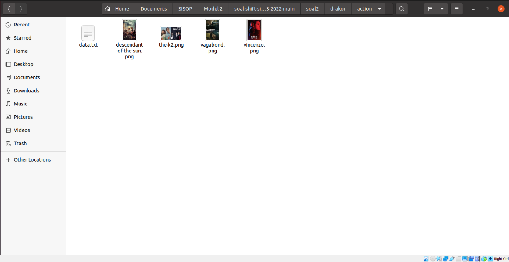
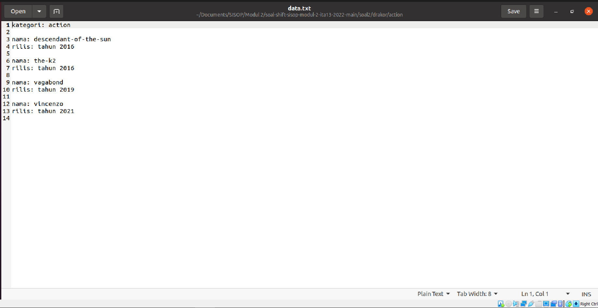

# soal-shift-sisop-modul-2-ITA13-2022

Modul 2

## Ginshin impict
Summary soal:
1. Download zip yang diberikan, lalu extract, lalu buat directory gacha_gacha
2. Gacha dipilih random, jumlah percobaan % 10 => buat file dengan format nama hH:mM:sS_gacha_jumlahgacha.txt dengan isi text berupa gacha random antara weapon dan character. percobaan ganjil => character, percobaan genap => weapon. Penulisan di text tersebut dengan format jumlahGacha_tipe_rarity_name_sisaPrimogems. nama dan rarity diambil dengan library json-c, dan primogems di define di awal dengan nilai 79000 dan tiap gacha dilakukan -160. Dan jika percobaan % 90 => buat folder dengan nama total_gacha_totalGachaDilakukan. dan isi folder berupa file gacha yang dibagikan tiap 10 kali. masing-masing file dengan dormat text sebelumnya.
3. Gacha dilakukan : 30 Maret jam 04:44, 3 jam kemudian, pada hari yang sama, akan dilakukan zip folder gacha_gacha dengan nama not_safe_for_wibu dengan password satuduatiga dan semua folder sebelumnya dihapus hingga menyisakan zip tersebut.
4. Semua proses dijalankan sekali, aka pakai daemon.

**Pre-process**

Mendefinisikan fungsi fork dan mendeclare nilai-nilai tertentu.
```c
void garputunggu(char bash[], char *arg[]){
    int status;
    pid_t child;
    child = fork();
    if(child == 0){
        execv(bash, arg);
    }
    else{
        ((wait(&status))>0);
    }
}

void zip_garputunggu(char bash[], char opsi[], char nm_zip[], char lokasi[]) {
    int status;
    pid_t child;
    child = fork();
    if(child == 0){
        execlp(bash, bash, opsi, nm_zip, lokasi, NULL);
    }
    else{
        ((wait(&status))>0);
    }
}

void rm_garputunggu(char bash[], char nm_file[]) {
    int status;
    pid_t child;
    child = fork();
    if(child == 0){
        execlp(bash, bash, nm_file, NULL);
    }
    else{
        ((wait(&status))>0);
    }
}


void rm_folder_garputunggu(char bash[], char opsi[], char nm_file[]) {
    int status;
    pid_t child;
    child = fork();
    if(child == 0){
        execlp(bash, bash, opsi, nm_file, NULL);
    }
    else{
        ((wait(&status))>0);
    }
}

int m = 0;
char gacha_weaponlist[200][200];
int n = 0;
char gacha_characterlist[100][200];
struct dirent *ep;
srand(time(0));

int primogems = 79000;

```

### a
mendownload kedua file dengan syntax berikut
```C
DIR *filecharacter = opendir("characters");
    if(filecharacter) {
        closedir(filecharacter);
    } else if(ENOENT == errno) {
        char link1[100] = "https://drive.google.com/uc?id=1xYYmsslb-9s8-4BDvosym7R4EmPi6BHp&export=download";

        char *chararcter[] = {"wget", "--no-check-certificate", link1,"-O","characterDB.zip", NULL};
        garputunggu("/usr/bin/wget", chararcter);
        sleep(10);
        char *unzipchar[] =  {"unzip", "characterDB.zip", NULL};
        garputunggu("/usr/bin/unzip", unzipchar);
        
    }

    // file weapon
    DIR *fileweapon = opendir("weapons");
    if(fileweapon) {
        closedir(fileweapon);
    } else if(ENOENT == errno) {
        char link2[100] = "https://drive.google.com/uc?id=1XSkAqqjkNmzZ0AdIZQt_eWGOZ0eJyNlT&export=download";

        char *weapon[] = {"wget", "--no-check-certificate", link2,"-O","weaponDB.zip", NULL};
        garputunggu("/usr/bin/wget", weapon);
        sleep(10);
        char *unzipweap[] =  {"unzip", "weaponDB.zip", NULL};
        garputunggu("/usr/bin/unzip", unzipweap);
        
    }
```
membuat dir gacha_gacha dengan syntax berikut
```c
DIR *filegacha = opendir("gacha_gacha");
    if(filegacha) {
        closedir(filegacha);
    } else if(ENOENT == errno) {
        char *buatdirgacha[] = {"mkdir", "gacha_gacha", NULL};
        garputunggu("/bin/mkdir", buatdirgacha);
    }
```
sebelum poin berikutnya, dilakukan pengecekan file dengan memasukkan seluruh isi dir weapon dan character ke dalam array dan dihitung berapa banyak isinya.
```c
if( m < 1 ) {
    DIR *bacaweapon = opendir("weapons");
    if(bacaweapon != NULL) {
        while(ep = readdir(bacaweapon)) {
            if (strcmp(ep->d_name, ".") != 0 && strcmp(ep->d_name, "..") != 0 && strstr(ep->d_name, "json")) {
                strcpy(gacha_weaponlist[m], ep->d_name);
                m++;
            }        
        } 
        // printf("%d\n", m);
        closedir(bacaweapon);
    } else perror ("Couldn't open the directory");
} 

if( n < 1 ) {
    DIR *bacacharacter = opendir("characters");
    if(bacacharacter != NULL) {
        while(ep = readdir(bacacharacter)) {
            if (strcmp(ep->d_name, ".") != 0 && strcmp(ep->d_name, "..") != 0) {
                strcpy(gacha_characterlist[n], ep->d_name);
                n++;
            }        
        } 
        closedir(bacacharacter);
    } else perror ("Couldn't open the directory");
}
```
hasil




### b
melakukan gacha dengan ketentuan ganjil = character dan genap = weapon. Dilakukan perobaan sebanyak random_acak setiap program dijalankan.
```c
int random_pilih = (rand() % 30) * 10;
int percobaan = random_pilih;
```
untuk percobaan mod 90, membuat folder dengan isi text sebanyak banyak percobaan/10:
```c
if(random_pilih % 90 == 0 && random_pilih != 0 && primogems > 159) {
    char sekarang[100] = "";
    int d_s = detik;
    sprintf(sekarang, "./gacha_gacha/total_gacha_%d_%d", random_pilih, d_s);
    // printf("%s", sekarang);
    // membuat dir dengan format yang sesuai 
    char *buatdir90[] = {"mkdir", sekarang, NULL};
    garputunggu("/bin/mkdir", buatdir90);

// syarat loop, misal 90, dilakukan loop 9 kali untuk masing-masing text dan primogems harus bisa dibagi 160
    for(int p = 0; p < percobaan/ 10 && primogems > 159; p++) {
        // mendapatkan nilai waktu sekarang tiap loop
        int detik, menit, jam;
        time_t now;
        time(&now);
        struct tm *local = localtime(&now);
        jam = local->tm_hour;
        menit = local->tm_min;
        detik = local->tm_sec;
        // tiap text terdapat perbedaan 1 detik
        sleep(1);
        strcpy(sekarang, "");
        sprintf(sekarang, "./gacha_gacha/total_gacha_%d_%d/%d:%d:%d_gacha_10.txt", random_pilih, d_s, jam, menit, detik);
        FILE *buat_txt = fopen(sekarang, "w");
        // printf("%s\n", sekarang);

        if(buat_txt == NULL) {
            printf("Unable to create file.\n");
            exit(EXIT_FAILURE);
        }
        // tiap file berisi 10 percobaan gacha
        int ulang = 10;
        while(ulang != 0 & primogems > 159) {
            primogems -= 160;
            // untuk genap = ambil weapon
            if(ulang % 2 == 0) {
                int weapon_random = rand() % m;
                char dirawal_w[100];
                strcpy(dirawal_w, "./weapons/");
                strcat(dirawal_w, gacha_weaponlist[weapon_random]);
                // printf("%s\n", dirawal_w);
                // proses pengambilan nama dan rarity dari weapon dengan library json-c
                FILE *json_weapon_file = fopen(dirawal_w, "r");
                char isijson_weapon[3000];
                fread(isijson_weapon, 3000, 1, json_weapon_file);
                fclose(json_weapon_file);

                struct json_object *parsed_json_w;
                struct json_object *name_weapon;
                struct json_object *rarity_weapon;

                parsed_json_w = json_tokener_parse(isijson_weapon);

                json_object_object_get_ex(parsed_json_w, "name", &name_weapon);
                json_object_object_get_ex(parsed_json_w, "rarity", &rarity_weapon);

                fprintf(buat_txt, "%d_weapons_%s_%s_%d\n", random_pilih, json_object_get_string(rarity_weapon), json_object_get_string(name_weapon), primogems);
                ulang -= 1;
            } else {
                // untuk ganjil ambir character
                int character_random = rand() % n;
                char dirawal_c[100];
                strcpy(dirawal_c, "./characters/");
                strcat(dirawal_c, gacha_characterlist[character_random]);
                
                // proses pengambilan nama dan rarity untuk character dengan library json-c
                FILE *json_character_file = fopen(dirawal_c, "r");
                char isijson_character[3000];
                fread(isijson_character, 3000, 1, json_character_file);
                fclose(json_character_file);

                struct json_object *parsed_json_c;
                struct json_object *name_character;
                struct json_object *rarity_character;

                parsed_json_c = json_tokener_parse(isijson_character);

                json_object_object_get_ex(parsed_json_c, "name", &name_character);
                json_object_object_get_ex(parsed_json_c, "rarity", &rarity_character);

                fprintf(buat_txt, "%d_characters_%s_%s_%d\n", random_pilih, json_object_get_string(rarity_character), json_object_get_string(name_character), primogems);
                ulang -= 1;
            }
        }
        fclose(buat_txt);
    }
```
untuk mod 10, dilakukan percobaan gacha sen=banyak random_pilih dan hasil dimasukkan ke dalam teks
```c
else if (random_pilih % 10 == 0 & random_pilih != 0 && primogems > 159) {
    char waktu[100] = "";
    //membuat text dengan format yang sesuai
    sprintf(waktu, "./gacha_gacha/%d:%d:%d_gacha_%d.txt", jam, menit, detik, random_pilih);
    // printf("%s", waktu);
    FILE *buat_txt = fopen(waktu, "w");

    if(buat_txt == NULL) {
        printf("Unable to create file.\n");
        exit(EXIT_FAILURE);
    }
    // loop dilakukan selagi [rimogems mencukupi
    while(percobaan != 0 && primogems > 159) {
        if (primogems / 160 > 0) {
            // untuk genap = weapon
            if(percobaan % 2 == 0) {
                int weapon_random = rand() % m;
                char dirawal_w[100];
                strcpy(dirawal_w, "./weapons/");
                strcat(dirawal_w, gacha_weaponlist[weapon_random]);
                // printf("%s\n", dirawal_w);
                // proses pengambilan name dan rarity dari weapon dengan library json-c
                FILE *json_weapon_file = fopen(dirawal_w, "r");
                char isijson_weapon[3000];
                fread(isijson_weapon, 3000, 1, json_weapon_file);
                fclose(json_weapon_file);

                struct json_object *parsed_json_w;
                struct json_object *name_weapon;
                struct json_object *rarity_weapon;

                parsed_json_w = json_tokener_parse(isijson_weapon);

                json_object_object_get_ex(parsed_json_w, "name", &name_weapon);
                json_object_object_get_ex(parsed_json_w, "rarity", &rarity_weapon);

                primogems -= 160;
                // masukkan hasil ke dalam teks yang telah dibuat
                fprintf(buat_txt, "%d_weapons_%s_%s_%d\n", random_pilih, json_object_get_string(rarity_weapon), json_object_get_string(name_weapon), primogems);
                percobaan -= 1;
            } else {
                // untuk ganjil = character
                int character_random = rand() % n;
                char dirawal_c[100];
                strcpy(dirawal_c, "./characters/");
                strcat(dirawal_c, gacha_characterlist[character_random]);

                // proses pengambilan name dan rarity character 
                FILE *json_character_file = fopen(dirawal_c, "r");
                char isijson_character[3000];
                fread(isijson_character, 3000, 1, json_character_file);
                fclose(json_character_file);

                struct json_object *parsed_json_c;
                struct json_object *name_character;
                struct json_object *rarity_character;

                parsed_json_c = json_tokener_parse(isijson_character);

                json_object_object_get_ex(parsed_json_c, "name", &name_character);
                json_object_object_get_ex(parsed_json_c, "rarity", &rarity_character);

                primogems -= 160;
                // masukkan hasil ke dalam teks
                fprintf(buat_txt, "%d_characters_%s_%s_%d\n", random_pilih, json_object_get_string(rarity_character), json_object_get_string(name_character), primogems);
                percobaan -= 1;
            }
        } else {
            fprintf(buat_txt, "Primogems anda habis");
            percobaan = 0;
            // return EXIT_SUCCESS;
        }
        
    }
    fclose(buat_txt);

}

```
hasil text dan folder



isi text



isi folder 



### c
penamaan file gacha
```c
sprintf(waktu, "./gacha_gacha/%d:%d:%d_gacha_%d.txt", jam, menit, detik, random_pilih);
FILE *buat_txt = fopen(waktu, "w");
```
untuk banyaknya percobaan didapat dengan menggunakan:
```c
int random_pilih = (rand() % 30) * 10;
int percobaan = random_pilih;
```
untuk waktu diambil dengan
```c
time_t now;
time(&now);
struct tm *local = localtime(&now);
jam = local->tm_hour;
menit = local->tm_min;
detik = local->tm_sec;
sleep(1);
```
untuk pembuatam tiap 1 detik, gunakan `sleep(1)`

### d
untuk mengambil data name dan rarity dari json, gunakan library json-c
untuk werpon
```c
int weapon_random = rand() % m;
char dirawal_w[100];
strcpy(dirawal_w, "./weapons/");
strcat(dirawal_w, gacha_weaponlist[weapon_random]);
// printf("%s\n", dirawal_w);
FILE *json_weapon_file = fopen(dirawal_w, "r");
char isijson_weapon[3000];
fread(isijson_weapon, 3000, 1, json_weapon_file);
fclose(json_weapon_file);

struct json_object *parsed_json_w;
struct json_object *name_weapon;
struct json_object *rarity_weapon;

parsed_json_w = json_tokener_parse(isijson_weapon);

json_object_object_get_ex(parsed_json_w, "name", &name_weapon);
json_object_object_get_ex(parsed_json_w, "rarity", &rarity_weapon);
```
untuk memasukkan hasil ke dalam text dengan format yang telah ditentukan:
```c
fprintf(buat_txt, "%d_weapons_%s_%s_%d\n", random_pilih, json_object_get_string(rarity_weapon), json_object_get_string(name_weapon), primogems);
```
untuk character
```c
int character_random = rand() % n;
char dirawal_c[100];
strcpy(dirawal_c, "./characters/");
strcat(dirawal_c, gacha_characterlist[character_random]);

FILE *json_character_file = fopen(dirawal_c, "r");
char isijson_character[3000];
fread(isijson_character, 3000, 1, json_character_file);
fclose(json_character_file);

struct json_object *parsed_json_c;
struct json_object *name_character;
struct json_object *rarity_character;

parsed_json_c = json_tokener_parse(isijson_character);

json_object_object_get_ex(parsed_json_c, "name", &name_character);
json_object_object_get_ex(parsed_json_c, "rarity", &rarity_character);
```
untuk memasukkan hasil ke dalam text dengan format yang telah ditentukan:
```c
fprintf(buat_txt, "%d_characters_%s_%s_%d\n", random_pilih, json_object_get_string(rarity_character), json_object_get_string(name_character), primogems);
```

### e
untuk melakukan daemon, dilakukan hal berikut:
```c
. . .
pid_t pid, sid;        // Variabel untuk menyimpan PID

pid = fork();     // Menyimpan PID dari Child Process

/* Keluar saat fork gagal
* (nilai variabel pid < 0) */
if (pid < 0) {
    exit(EXIT_FAILURE);
}

/* Keluar saat fork berhasil
* (nilai variabel pid adalah PID dari child process) */
if (pid > 0) {
    exit(EXIT_SUCCESS);
}

umask(0);

sid = setsid();
if (sid < 0) {
    exit(EXIT_FAILURE);
}

if ((chdir(dirutama)) < 0) {
    exit(EXIT_FAILURE);
}

close(STDIN_FILENO);
close(STDOUT_FILENO);
close(STDERR_FILENO);
```
kemudian semua proses dimasukkan ke dalam while loop dengan sleep sebanyak 1 second:
```c
while(1) {
    // semua program dimasukkan disini
    sleep(1);
}
```
untuk pengecekan waktu, di dalam loop memasukkan:
```c
int detik, menit, jam, hari, bulan;
time_t now;
time(&now);
struct tm *local = localtime(&now);
jam = local->tm_hour;
menit = local->tm_min;
detik = local->tm_sec;
hari = local->tm_mday;
bulan = local->tm_mon;
```
dan untuk pengecekan waktu di masukkan di pengecekan.
untuk proses gacha yang dilakukan pada 30 Maret jam 04:44 dan 3 jam kemudian untuk zip file gacha_gachaq
```c
. . .
 if(bulan == 3 && hari == 30 && jam == 4 && menit == 44) {
     // Program gacha disini
 } else if (bulan == 3 && hari == 30 && jam == 7 && menit == 44) {
     .// program zip disini
 }
 . . .
```
untuk proses zip dan delete file pada 3 jam kemudian:
```c
 else if(bulan == 3 && hari == 30 && jam == 7 && menit == 44) {
    zip_garputunggu("zip", "-r", "a", "gacha_gacha");
    rm_folder_garputunggu("rm", "-r", "./gacha_gacha");
    rm_folder_garputunggu("rm", "-r", "./weapons");
    rm_folder_garputunggu("rm", "-r", "./characters");
    rm_garputunggu("rm", "characterDB.zip");
    rm_garputunggu("rm", "weaponDB.zip");
    return EXIT_SUCCESS;
}   
```
hasil zip dan semua file sebelumnya di hapus



isi zip



## Drakor


Japrun bekerja di sebuah perusahaan dibidang review industri perfilman, karena kondisi saat ini sedang pandemi Covid-19, dia mendapatkan sebuah proyek untuk mencari drama korea yang tayang dan sedang ramai di Layanan Streaming Film untuk diberi review. Japrun sudah mendapatkan beberapa foto-foto poster serial dalam bentuk zip untuk diberikan review, tetapi didalam zip tersebut banyak sekali poster drama korea dan dia harus memisahkan poster-poster drama korea tersebut tergantung dengan kategorinya. Japrun merasa kesulitan untuk melakukan pekerjaannya secara manual, kamu sebagai programmer diminta Japrun untuk menyelesaikan pekerjaannya.

Summary Soal:
1. Unzip dari zip file yang diberikan, lalu filter sampai yang keluar hanya poster drakor, hasil filter ditaruh di folder drakor
2. Setiap poster drakor memiliki kategori di nama file nya, buatlah folder kategori berdasarkan hal tersebut
3. Setiap poster dipindah ke kategorinya masing-masing dan diubah namanya menjadi nama drakornya saja.
4. Ada beberapa file yang mengandung 2 poster, pisahkan dan ditaruh seperti no. 3
5. Buatlah sebuah file `data.txt` di setiap folder kategori dimana file itu berisi nama poster dan tahun rilis dari poster dan harus berurut berdasarkan tahun rilis

## Penjelasan Code Soal 2

Kode diawali dengan unzip dimana unzip itu sendiri langsung memfilter file-file yang tidak perlu

```c
char *argv[ ] = {"unzip", "drakor.zip", "*.png", "-d", "drakor", NULL};
execv("/bin/unzip", argv);
```
Dengan menambahkan "*.png" proses unzip akan mengeluarkan file yang memiliki akhiran .png dimana yang memiliki ciri-ciri itu hanyalah 
poster yang ada di zip `drakor.zip`. Lalu dengan menambahkan "-d" dan "drakor" akan melakukan setiap file yang diunzip akan dimasukan
ke folder drakor. Setelah berhasil diunzip, akan dilanjutkan ke fungsi `REAL_PROCESS()`.

Memasuki fungsi `REAL_PROCESS()`, kami akan membuka direktori drakor yang baru saja dibuat untuk menelusuri semua gambar yang berisi
poster-poster drakor. 

```c
        while ((dir = readdir(d)) != NULL) {
            if (strcmp(dir->d_name, ".") == 0 || strcmp(dir->d_name, "..") == 0 || strcmp(dir->d_name, "dummy.txt") == 0) continue;
            char filename[1005];
            snprintf(filename, sizeof filename, "%s", dir->d_name);
            //printf("%s\n", filename);
            char str[1005];
            strcpy(str, filename);

            char *token = strtok(str, ";");

            char drakor[55];
            snprintf(drakor, sizeof drakor, "%s", token);
            token = strtok(NULL, ";");
            //printf("drakor: %s\n" , drakor);

            char tahun[15];
            snprintf(tahun, sizeof tahun, "%s", token);
            token = strtok(NULL, ";._");
            //printf("tahun: %s\n" , tahun);

            char kategori[15];
            snprintf(kategori, sizeof kategori, "%s", token);
            token = strtok(NULL, ";");
            //printf("kategori: %s\n" , kategori);

            //create directory
            makedir(kategori);
            
            //copy files to category directory
            copyf(drakor, kategori, filename);
            
            snprintf(ls[i], sizeof ls[i], "%s;%s;%s", kategori, tahun, drakor);
            i++;
            //printf("write %s;%s;%s on dummy.txt\n", kategori, tahun, drakor);

            if(strlen(token) > 3){
                //printf("next up: %s\n", token);

                char drakor2[55];
                snprintf(drakor2, sizeof drakor2, "%s", token);
                token = strtok(NULL, ";");
                //printf("drakor2: %s\n" , drakor2);

                char tahun2[15];
                snprintf(tahun2, sizeof tahun2, "%s", token);
                token = strtok(NULL, ";._");
                //printf("tahun2: %s\n" , tahun2);

                char kategori2[15];
                snprintf(kategori2, sizeof kategori2, "%s", token);
                token = strtok(NULL, "_");
                //printf("kategori2: %s\n" , kategori2);

                //create directory
                makedir(kategori2);
                
                //copy files to category directory
                copyf(drakor2, kategori2, filename);

                snprintf(ls[i], sizeof ls[i], "%s;%s;%s", kategori2, tahun2, drakor2);
                i++;
                //printf("write %s;%s;%s on dummy.txt\n", kategori2, tahun2, drakor2);
            }

            printf("Deleting the poster %s\n", filename);
            del(filename);

        }
        closedir(d);
```

Dengan menggunakan `strtok` dengan delimiter `.;_` kita bisa mendapatkan nama, tahun rilis, serta kategori poster tersebut.
Setelah didapatkan informasi dari poster tersebut, kami membuat folder berdasarkan kategori, menyalin file dengan mengubah nama 
berdasarkan nama poster drakor, dan mencatat `data.txt` dengan tahun rilis. Setelah file disalin, kami membuat list string `ls`
dimana variabel itu akan menyimpan data kategori, tahun rilis, dan nama dengan format `kategori;tahun;nama` dimana dengan model
ini akan membantu dalam mengurutkan berdasarkan tahun rilis untuk menulis `data.txt`.

Dalam kasus 2 poster dalam satu file dengan mengecek hasil `strtok` setelah strtok ketiga kali. Jika hasil `strtok` tersebut memiliki
panjang string yang lebih dari 3, maka file tersebut memiliki 2 poster.

```c
int it,jt;
char temp[105];
//Sort array using the Buuble Sort algorithm
for(it=0; it<20; it++){
    for(jt=0; jt<20-1-it; jt++){
        if(strcmp(ls[jt], ls[jt+1]) > 0){
            //swap ls[j] and ls[j+1]
            strcpy(temp, ls[jt]);
            strcpy(ls[jt], ls[jt+1]);
            strcpy(ls[jt+1], temp);
        }
    }
}
```

Untuk proses sorting kami menggunakan Bubble Sort Algorithm dimana kode ini didapatkan dari Template GeekForGeeks.

```c
for(it=1; it<20; it++){
    //printf("%s\n", ls[it]);
    char st[105];
    snprintf(st, sizeof st, "%s", ls[it]);
    //printf("%s\n", st);

    char *token = strtok(st, ";");

    char kategori[15];
    snprintf(kategori, sizeof kategori, "%s", token);
    token = strtok(NULL, ";");

    //printf("get kategori %s\n", kategori);

    char tahun[15];
    snprintf(tahun, sizeof tahun, "%s", token);
    token = strtok(NULL, ";");

    //printf("get tahun %s\n", tahun);

    char drakor[55];
    snprintf(drakor, sizeof drakor, "%s", token);
    token = strtok(NULL, ";");

    //printf("get drakor %s\n", drakor);

    char path[35];
    snprintf(path, sizeof path, "drakor/%s/data.txt", kategori);
    //printf("get path %s\n", path);

    FILE *data;
    data = fopen(path, "a+");
    //printf("open txt file success\n");
    if(strcmp(temp, kategori) != 0){
        //printf("write kategori %s as header\n", kategori);
        fprintf(data, "kategori: %s\n\n", kategori);
    }
    fprintf(data, "nama: %s\n", drakor);
    fprintf(data, "rilis: tahun %s\n\n", tahun);
    // printf("success write data in txt\n");

    fclose(data);
    strcpy(temp, kategori);
}
```

Untuk bagian ini khusus untuk menulis `data.txt` untuk setiap kategori. Dengan memperhatikan kategori terlebih dahulu, saat mencapai
awal dari kategori, akan dibuatkan "kategori: `nama kategori`". Dengan menggunakan `strtok` dengan delimiter `;` bisa didapatkan kembali 
kategori, tahun rilis, dan nama. Dengan begitu kita bisa menulis nama drakor dan tahun rilis.

**Penjelasan Fungsi Tambahan**

1. `run_it(char bash[ ], char *argv[ ])`
```c
void run_it(char bash[ ], char *argv[ ]){
    int status;
    pid_t child = fork();

    if(child == 0){
        execv(bash, argv);
    } else while(wait(&status) > 0);
}
```

Fungsi ini akan melakukan fork lalu melakukan execv berdasarkan `*argv[ ]` dan  `bash[ ]` agar fork yang dilakukan tidak mengganggu proses 
yang sedang berjalan.

2. `makedir(char kategori [ ])`
```c
void makedir(char kategori[ ]){

    char target[205];
    snprintf(target, sizeof target, "drakor/%s", kategori);
    char *argv[ ] = {"mkdir", "-p", target, NULL};
    
    run_it("/usr/bin/mkdir", argv);
}
```

Fungsi ini akan membuat direktori berdasarkan string yang diberikan. Untuk disini stringnya adalah `kategori[ ]`.

3. `copyf(char nama[ ], char kategori[ ], char fileName[ ] )`
```c
void copyf(char nama[ ], char kategori[ ], char fileName[ ] ) {

    char target[2005];
    char new_file[2005];
    snprintf(target, sizeof target, "drakor/%s", fileName);
    snprintf(new_file, sizeof new_file, "drakor/%s/%s.png", kategori, nama);

    //printf("%s\n", target);
    //printf("%s\n", new_file);
    
    char *argv[ ] = {"cp", target, new_file, NULL};
    char bash[ ] = "/usr/bin/cp";
    run_it(bash, argv);
}
```

Fungsi ini akan menyalin file berdasarkan `fileName[ ]` ke dalam `kategori[ ]` dengan nama `nama[ ]`.

4. `del(char fileName[ ])`
```c
void del(char fileName[ ]){
    char target[2005];
    snprintf(target, sizeof target, "drakor/%s", fileName);
    //printf("%s\n", target);

    char *argv[ ] = {"rm", target, NULL};
    char bash[ ] = "/usr/bin/rm";
    run_it(bash, argv);
}
```
Fungsi ini akan menghapus file berdasarkan `fileName[ ]`.

## Kendala Yang Dihadapi Soal 2
Kendala yang kami hadapi, kami sering menjumpai segmentation error. Hal ini dijumpai karena kami mengunjungi direktori yang masih belum dibuat.

Saat melakukan `strtok`, karena delimiter yang diberikan kurang, maka terciptalah direktori dengan nama (null).

## Screenshot Hasil Run Soal 2






## Conan ngurusin kebun binatang fsr
Summary soal:
1. Buat folder modul2, didalamnya buat folder darat, 3 detik kemudian, buat folder air.
2. Extract zip animal, masukan folder animal ke dalam folder modul2.
3. gambar dengan tulisan darat -> masukkan ke folder darat, gambar dengan tulisan air -> masukkan ke folder air, tidak keduanya -> hapus.
4. Semua gambar bertulisan bird di dalam folder darat dihapus.
5. Semua gambar di dalam folder air di masukkan ke dalam list.txt dengan format \{nama user\}\_\{UID file\}\_\{nama file\}.

**Pre-process**

Mendefinisikan fungsi fork
```C
void garputunggu(char bash[], char *arg[]){
    int status;
    pid_t child;
    child = fork();
    if(child == 0){
        execv(bash, arg);
    }
    else{
        ((wait(&status))>0);
    }
}

void mv_garputunggu(char bash[], char nm_file[], char tujuan[]) {
    int status;
    pid_t child;
    child = fork();
    if(child == 0){
        execlp(bash, bash, nm_file, tujuan, NULL);
    }
    else{
        ((wait(&status))>0);
    }
}

void rm_garputunggu(char bash[], char nm_file[]) {
    int status;
    pid_t child;
    child = fork();
    if(child == 0){
        execlp(bash, bash, nm_file, NULL);
    }
    else{
        ((wait(&status))>0);
    }
}
```

### a
membuat folder dengan memanfaatkan fork() dan exec(), dimana pembuatan folder air ditunggu 3 detik.
```c
char *argvmkdirmodul[] = {"mkdir", "modul2", NULL};
char *argvmkdirdarat[] = {"mkdir", "modul2/darat", NULL};
char *argvmkdirair[] = {"mkdir", "modul2/air", NULL};

garputunggu("/bin/mkdir", argvmkdirmodul);
garputunggu("/bin/mkdir", argvmkdirdarat);
sleep(3);
garputunggu("/bin/mkdir", argvmkdirair);
```

### b
Proses seperti di atas, memanggil fungsi 'garputunggu'
```C
char *argvunziphewan[] =  {"unzip", "animal.zip", "-d", "modul2", NULL};
garputunggu("/usr/bin/unzip", argvunziphewan);
```

### c
memindah foto-foto dari folder ke animal ke foldernya masing-masing sesuai nama, gunakan berikut:
1. Pilih directory animal
2. Read semua file di dalam dir
3. cek tiap nama file, kalau ada tulisan darat, pindah ke dir darat, begitu juga dengan yang air
4. Tidak ada keduanya? hapus
```C
DIR *dp;
struct dirent *ep;

dp = opendir(unziplocation);
if(dp != NULL) {
    while((ep = readdir(dp))) {
        if (strcmp(ep->d_name, ".") != 0 && strcmp(ep->d_name, "..") != 0 && strstr(ep->d_name, "darat")) {
            char awal[100] = "modul2/animal/";
            strcat(awal, ep->d_name); 
            // printf("%s\n", awal);
            // char *argvhewandarat[] =  {"mv", awal,"modul2/darat", NULL};
            // sleep(1);
            // garputunggu("usr/bin/mv", argvhewandarat);
            mv_garputunggu("mv", awal, "modul2/darat");
        } else if (strcmp(ep->d_name, ".") != 0 && strcmp(ep->d_name, "..") != 0 && strstr(ep->d_name, "air")) {
            char awal[100] = "modul2/animal/";
            strcat(awal, ep->d_name); 
            // printf("%s\n", awal);
            // char *argvhewandarat[] =  {"mv", awal,"modul2/darat", NULL};
            // sleep(1);
            // garputunggu("usr/bin/mv", argvhewandarat);
            mv_garputunggu("mv", awal, "modul2/air");
        } else {
            if (strcmp(ep->d_name, ".") != 0 && strcmp(ep->d_name, "..") != 0) {
                char awal[100] = "modul2/animal/";
                strcat(awal, ep->d_name); 
                // char *argvrm[] = {"rm", , NULL};
                rm_garputunggu("rm", awal);
            }
            
        }
    }
    (void) closedir (dp);
} else  perror ("Couldn't open the directory");
```

### d
Semua bird di dalam dir darat harus dihapus. gunakan langkah dengan yang sama, jika ada tulisan bird, hapus.
```C
DIR *darat;

darat = opendir(filedarat);
if(darat != NULL) {
    while((ep = readdir(darat))) {
        if (strcmp(ep->d_name, ".") != 0 && strcmp(ep->d_name, "..") != 0 && strstr(ep->d_name, "bird")) {
            char awal[100] = "modul2/darat/";
            strcat(awal, ep->d_name); 
            rm_garputunggu("rm", awal);
        }
    }
    (void) closedir (darat);
} else  perror ("Couldn't open the directory");
```

### e
semua isi di dir ikan dibuat list dengan format user_UID_namafile.
```C
DIR *air;

air = opendir(fileair);
FILE *list_hewan = fopen("./modul2/air/list.txt", "w");

struct stat fs;
int r;

if(air != NULL) {
        while((ep = readdir(air))) {
        if (strcmp(ep->d_name, ".") != 0 && strcmp(ep->d_name, "..") != 0 && strstr(ep->d_name, "jpg")) {
            char awal[100] = "modul2/air/";
            strcat(awal, ep->d_name);
            r = stat(awal, &fs);
            char baca = '_', tulis = '_', jalan= '_';
            if( fs.st_mode & S_IRUSR ) baca = 'r';
            if( fs.st_mode & S_IWUSR ) tulis = 'w';
            if( fs.st_mode & S_IXUSR ) jalan = 'x';
            fprintf(list_hewan, "%s_%c%c%c_%s\n", nama, baca, tulis, jalan, ep->d_name);
        }
    }
    (void) closedir (air);
} else  perror ("Couldn't open the directory");

fclose(list_hewan);
```
